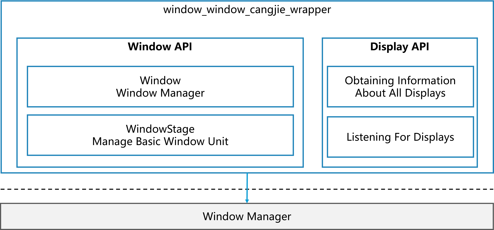

# Window Cangjie Wrapper<a name="EN-US_TOPIC_0000001076213364"></a>


## Introduction<a name="section15701932113019"></a>

The Window Manager subsystem provides basic capabilities of window and display management. Window Cangjie Interface is only available for standard devices.

## System Architecture

Framework architecture:



As shown in the architecture diagram:

**Interface Layer**: Provides interface declarations for developers.
-   **Window**: Offers fundamental capabilities for window management, including creating and destroying the current window, setting various properties, and managing/scheduling interactions between different windows.
-   **Display**: Provides basic capabilities for managing display devices, including retrieving information about the default display device, obtaining information for all display devices, and monitoring the connection and removal of display devices.

**Framework Layer**: Implements Cangjie window management and display device management by encapsulating underlying window services and display device management services.
-   **Window Wrapper**: The Cangjie module implements window management capabilities, connecting to the window subsystem via Cangjie C-language interoperation.
-   **Display Wrapper**: The Cangjie module implements screen property management capabilities, connecting to the window subsystem via Cangjie C-language interoperation.

**Description of Dependent Components in the Architecture Diagram:**

-   **window_manager**: The Cangjie interface encapsulation relies on the window services and display device services provided by the window subsystem.
-   **ability_runtime**: The Window Wrapper relies on the BaseContext query capability provided by the Ability Runtime subsystem.
-   **arkui_cangjie_wrapper**: The Window Wrapper and Display Wrapper encapsulation rely on the basic types provided by the arkui_cangjie_wrapper.
-   **ability_cangjie_wrapper**: The Window Wrapper relies on the interface for obtaining AbilityContext provided by the ability_cangjie_wrapper.
-   **cangjie_ark_interop**: The Window Wrapper and Display Wrapper encapsulation rely on the APILevel capability provided by cangjie_ark_interop for API management.
-   **multimedia_cangjie_wrapper**: The Window Wrapper relies on the image processing capabilities provided by the multimedia_cangjie_wrapper.
-   **hiviewdfx_cangjie_wrapper**: The Window Wrapper and Display Wrapper encapsulation rely on the Hilog logging capability provided by the hiviewdfx_cangjie_wrapper.

## Directory Structure<a name="section1791423143211"></a>

```
foundation/window/window_cangjie_wrapper/
├── figures                           # Architectural diagrams for README
├── ohos                              # Cangjie interface implementation source code directory
│   ├── display                       # Display device management related interface implementation
│   └── window                        # Window management related interface implementation
└── test                              # Test cases directory
```

## When to Use<a name="section171384529150"></a>

The Cangjie Window module currently provides functionality related to windows and screen properties.

The scope of capabilities includes:
- **Window**: Provides fundamental capabilities for managing windows, including creating and destroying the current window, setting various properties, and managing/scheduling interactions between windows.
- **Display**: Offers basic capabilities for managing display devices, including retrieving information about the default display device, obtaining information for all display devices, and monitoring the connection and removal of display devices.

For Window APIs, please refer to the [Cangjie Window API Documentation](https://gitcode.com/openharmony-sig/arkcompiler_cangjie_ark_interop/blob/master/doc/API_Reference/source_en/arkui-cj/cj-apis-window.md). For related guides, please see the [Window Development Guide](https://gitcode.com/openharmony-sig/arkcompiler_cangjie_ark_interop/blob/master/doc/Dev_Guide/source_en/windowmanager/application-window-stage.md).

For Display APIs, please refer to the [Cangjie Display API Documentation](https://gitcode.com/openharmony-sig/arkcompiler_cangjie_ark_interop/blob/master/doc/API_Reference/source_en/arkui-cj/cj-apis-display.md). For related guides, please see the [Display Development Guide](https://gitcode.com/openharmony-sig/arkcompiler_cangjie_ark_interop/blob/master/doc/Dev_Guide/source_en/displaymanager/screenProperty-guideline.md).

## Limitation

Compared to ArkTS, the following capabilities are not yet available:  
- Picture-in-picture window: Provides basic picture-in-picture functionality, including determining whether the current system supports picture-in-picture and creating a picture-in-picture controller to start or stop picture-in-picture. For details, refer to [Picture-in-Picture Window](https://gitcode.com/openharmony/docs/blob/master/en/application-dev/reference/apis-arkui/js-apis-pipWindow.md).  
- Floating ball window: Offers basic floating ball functionality, including determining whether the device supports the floating ball feature and creating a floating ball controller to start, update, or stop the floating ball. For details, refer to [Floating Ball Window](https://gitcode.com/openharmony/docs/blob/master/en/application-dev/reference/apis-arkui/js-apis-floatingBall.md).  
- Screenshot: Provides screenshot capability. For details, refer to [Screenshot](https://gitcode.com/openharmony/docs/blob/master/en/application-dev/reference/apis-arkui/js-apis-screenshot.md).

## How to Contribute<a name="section171384529153"></a>

Developers are welcome to contribute code, documentation, etc. For specific contribution processes and methods, please refer to [Code Contribution](https://gitcode.com/openharmony/docs/blob/master/en/contribute/how-to-contribute.md).

## Repositories Involved<a name="section1447164910172"></a>

[ability_ability_cangjie_wrapper](https://gitcode.com/openharmony-sig/ability_ability_cangjie_wrapper)

[arkui_arkui_cangjie_wrapper](https://gitcode.com/openharmony-sig/arkui_arkui_cangjie_wrapper)

[arkcompiler_cangjie_ark_interop](https://gitcode.com/openharmony-sig/arkcompiler_cangjie_ark_interop)

[hiviewdfx_hiviewdfx_cangjie_wrapper](https://gitcode.com/openharmony-sig/hiviewdfx_hiviewdfx_cangjie_wrapper)

[multimedia_multimedia_cangjie_wrapper](https://gitcode.com/openharmony-sig/multimedia_multimedia_cangjie_wrapper)

[ability_ability_runtime](https://gitcode.com/openharmony/ability_ability_runtime)

[window_window_manager](https://gitcode.com/openharmony/window_window_manager)