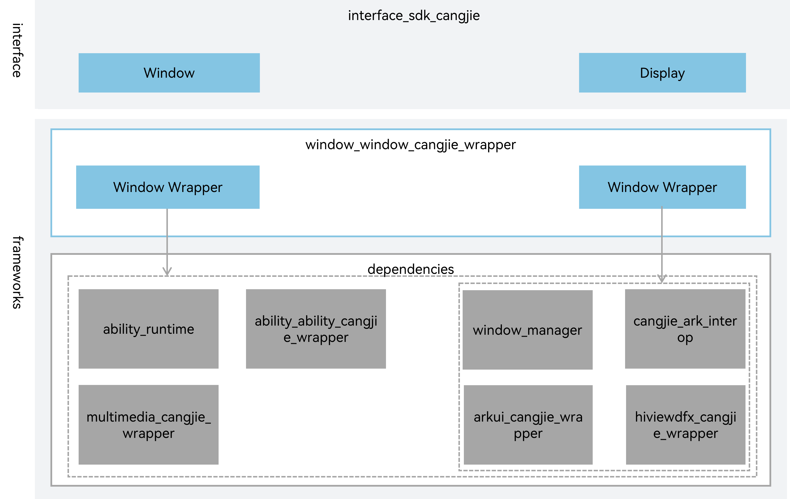

# Window Cangjie Interface<a name="EN-US_TOPIC_0000001076213364"></a>

-   [Introduction](#section15701932113019)
-   [Directory Structure](#section1791423143211)
-   [How to Build](#section171384529151)
-   [When to Use](#section171384529150)
-   [Developer Document](#section171384529152)
-   [How to contribute](#section171384529153)
-   [Repositories Involved](#section1447164910172)

## Introduction<a name="section15701932113019"></a>

The Window Manager subsystem provides basic capabilities of window and display management. Window Cangjie Interface is only available for standard devices.

Framework architecture:



## Directory Structure<a name="section1791423143211"></a>

```
foundation/window/window_cangjie_wrapper/
├── figures                            # Architectural diagram
├── ohos                               
|   |── display                        # Cangjie display implement
|   |── window                         # Cangjie window implement
├── test                               # Test case for window cangjie API
```

## When to Use<a name="section171384529150"></a>

Window Cangjie Interface, provide Widnow manage and Display manage API.

The following features are provided:
- Window API: Obtain window instance, pelease refer to [Window](https://gitcode.com/openharmony-sig/arkcompiler_cangjie_ark_interop/blob/master/doc/API_Reference/source_en/arkui-cj/cj-apis-window.md).
- WindowStage API: Manage window units.
- Display API: manage display devices, obtain all display devices info and subscribe display devices

The following features are not provided yet:
- Pipwindow: provides basic APIs for manipulating Picture in Picture (PiP)
- Screenshot: provides the screen capture capability


## Developer Document<a name="section171384529152"></a>

[API Document](https://gitcode.com/openharmony-sig/arkcompiler_cangjie_ark_interop/blob/master/doc/API_Reference/source_en/arkui-cj/cj-apis-window.md)

[Develop Guide](https://gitcode.com/openharmony-sig/arkcompiler_cangjie_ark_interop/blob/master/doc/API_Reference/summary_cjnative_ohos_EN.md)

## How to Contribute<a name="section171384529153"></a>

Developers are welcome to contribute code, documentation, etc. For specific contribution processes and methods, please refer to [Code Contribution](https://gitcode.com/openharmony/docs/blob/master/en/contribute/how-to-contribute.md).

## Repositories Involved

[ability_ability_cangjie_wrapper](https://gitcode.com/openharmony-sig/ability_ability_cangjie_wrapper)

[arkui_arkui_cangjie_wrapper](https://gitcode.com/openharmony-sig/arkui_arkui_cangjie_wrapper)

[arkcompiler_cangjie_ark_interop](https://gitcode.com/openharmony-sig/arkcompiler_cangjie_ark_interop)

[hiviewdfx_hiviewdfx_cangjie_wrapper](https://gitcode.com/openharmony-sig/hiviewdfx_hiviewdfx_cangjie_wrapper)

[multimedia_multimedia_cangjie_wrapper](https://gitcode.com/openharmony-sig/multimedia_multimedia_cangjie_wrapper)

[ability_ability_runtime](https://gitee.com/openharmony/ability_ability_runtime)

[window_window_manager](https://gitee.com/openharmony/window_window_manager)