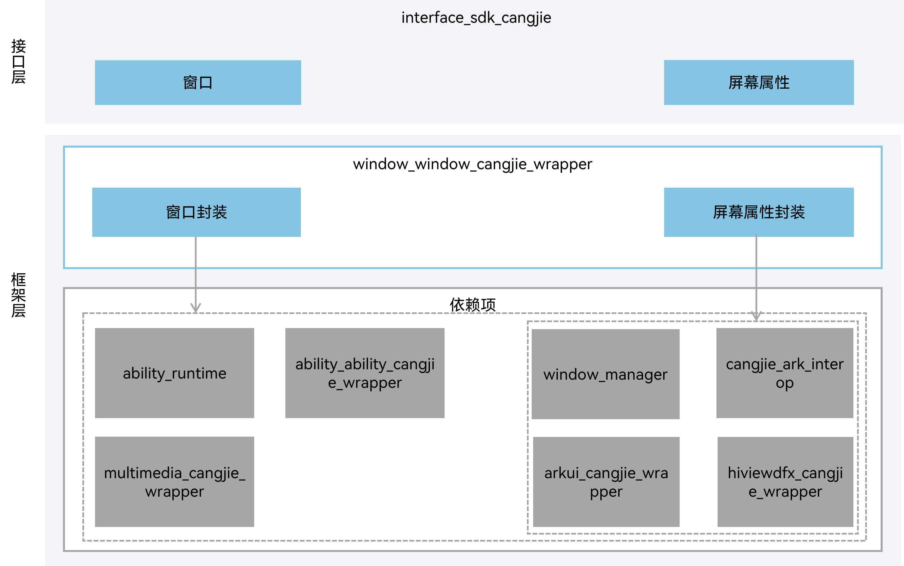

# 窗口仓颉封装<a name="ZH-CN_TOPIC_0000001076213364"></a>

## 简介<a name="section15701932113019"></a>

窗口仓颉封装提供了窗口管理和显示设备管理的基础能力，开发者使用仓颉开发应用时可以使用窗口仓颉接口进行窗口的创建、销毁、各属性设置。当前开放的窗口仓颉接口仅支持standard设备。

## 系统架构

其主要结构如下图所示：



如架构图所示：

接口层：面向开发者提供接口声明
- 窗口：提供管理窗口的一些基础能力，包括对当前窗口的创建、销毁、各属性设置，以及对各窗口间的管理调度。
- 屏幕属性：性提供管理显示设备的一些基础能力，包括获取默认显示设备的信息，获取所有显示设备的信息以及监听显示设备的插拔行为。

框架层：基于底层窗口服务和显示设备管理服务，封装实现仓颉窗口管理和显示设备管理
- 窗口封装：仓颉封装实现窗口管理能力，通过仓颉C语言互操作对接到窗口子系统。
- 屏幕属性封装：仓颉封装实现屏幕属性管理能力，通过仓颉C语言互操作对接到窗口子系统。

架构图中依赖部件引入说明：

- window_manager：仓颉接口封装依赖窗口子系统提供的窗口服务和显示设备服务
- ability_runtime：窗口封装依赖元能力子系统提供的BaseContext查询能力
- arkui_cangjie_wrapper：窗口封装和屏幕属性封装依赖arkui_cangjie_wrapper提供的基础类型
- ability_cangjie_wrapper：窗口封装依赖依赖ability_cangjie_wrapper提供获取AbilityContext接口
- cangjie_ark_interop：窗口封装和屏幕属性封装依赖cangjie_ark_interop提供的APILevel能力进行API管理
- multimedia_cangjie_wrapper：窗口封装依赖multimedia_cangjie_wrapper提供的图像处理能力
- hiviewdfx_cangjie_wrapper：窗口封装和屏幕属性封装依赖hiviewdfx_cangjie_wrapper提供的Hilog日志能力

## 目录<a name="section1791423143211"></a>
```
foundation/window/window_cangjie_wrapper/
├── figures                           # 存放readme中的架构图
├── ohos                              # 仓颉接口实现源码目录
│   ├── display                       # 屏幕属性相关接口实现
│   └── window                        # 窗口相关接口实现
├── test                              # 测试用例存放目录
│   ├── display_test                  # display相关测试用例目录
│   └── window_test                   # window相关测试用例目录
```

## 使用说明<a name="section171384529150"></a>

窗口仓颉封装当前提供提供窗口和屏幕属性相关功能。

提供的能力范围包括：
- 窗口提供管理窗口的一些基础能力，包括对当前窗口的创建、销毁、各属性设置，以及对各窗口间的管理调度。
- 屏幕属性提供管理显示设备的一些基础能力，包括获取默认显示设备的信息，获取所有显示设备的信息以及监听显示设备的插拔行为。

窗口相关API请参见[仓颉窗口API文档](https://gitcode.com/openharmony-sig/arkcompiler_cangjie_ark_interop/blob/master/doc/API_Reference/source_zh_cn/arkui-cj/cj-apis-window.md)，相关指导请参见[窗口开发指南](https://gitcode.com/openharmony-sig/arkcompiler_cangjie_ark_interop/blob/master/doc/Dev_Guide/source_zh_cn/windowmanager/application-window-stage.md)。

## 约束

与ArkTS相比，暂未提供以下能力：
- 画中画窗口：提供画中画基础功能，包括判断当前系统是否支持画中画功能，以及创建画中画控制器用于启动或停止画中画等。详细介绍请参考[画中画窗口](https://gitcode.com/openharmony/docs/blob/master/zh-cn/application-dev/reference/apis-arkui/js-apis-pipWindow.md)。
- 闪控球窗口：提供闪控球的基础功能，包括判断设备是否支持闪控球功能，以及创建闪控球控制器来启动、更新或停止闪控球。详细介绍请参考[闪控球窗口](https://gitcode.com/openharmony/docs/blob/master/zh-cn/application-dev/reference/apis-arkui/js-apis-floatingBall.md)。
- 屏幕截图：提供屏幕截图能力。详细介绍请参考[屏幕截图](https://gitcode.com/openharmony/docs/blob/master/zh-cn/application-dev/reference/apis-arkui/js-apis-screenshot.md)。

## 参与贡献<a name="section171384529153"></a>

欢迎广大开发者贡献代码、文档等，具体的贡献流程和方式请参见[参与贡献](https://gitcode.com/openharmony/docs/blob/master/zh-cn/contribute/%E5%8F%82%E4%B8%8E%E8%B4%A1%E7%8C%AE.md)。

## 相关仓<a name="section171384529156"></a>

[ability_ability_cangjie_wrapper](https://gitcode.com/openharmony-sig/ability_ability_cangjie_wrapper)

[arkui_arkui_cangjie_wrapper](https://gitcode.com/openharmony-sig/arkui_arkui_cangjie_wrapper)

[arkcompiler_cangjie_ark_interop](https://gitcode.com/openharmony-sig/arkcompiler_cangjie_ark_interop)

[hiviewdfx_hiviewdfx_cangjie_wrapper](https://gitcode.com/openharmony-sig/hiviewdfx_hiviewdfx_cangjie_wrapper)

[multimedia_multimedia_cangjie_wrapper](https://gitcode.com/openharmony-sig/multimedia_multimedia_cangjie_wrapper)

[ability_ability_runtime](https://gitcode.com/openharmony/ability_ability_runtime)

[window_window_manager](https://gitcode.com/openharmony/window_window_manager)
